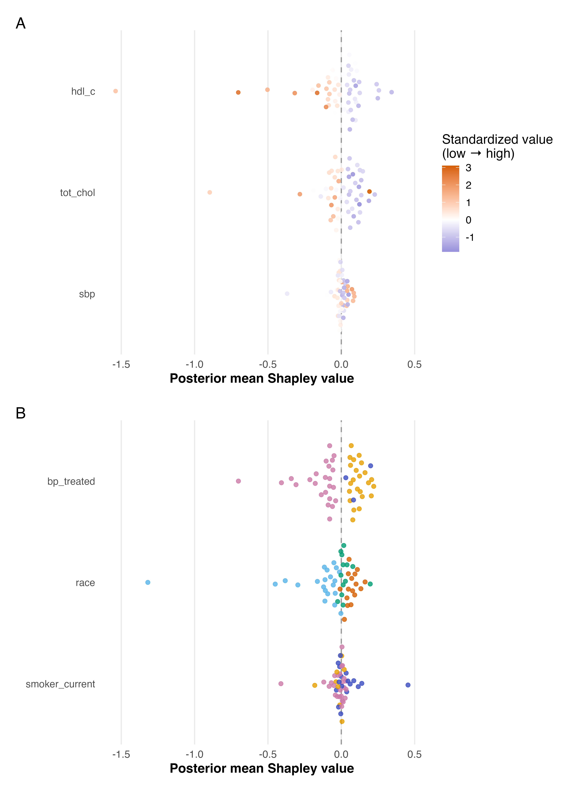

# Introduction

We study how early-life factors influence the likelihood of autism using data from the Study to Explore Early Development (SEED). We proceed one factor at a time, which we denote by $X$. The outcome, autism status, is denoted by $Y$. The remaining early-life factors are denoted by $Z$ and include both the other predictors we care about and other variables that may confound the relationship For each choice in $X$, we compare what happens when that factor changes, while holding fixed a common set of other early-life variables. For instance, when examining maternal age, we also adjust for paternal age and related perinatal factors that are related to maternal age and autism. Using the same adjustment set throughout keeps the comparisons consistent: every effect is defined within the same causal framework.

Our goal is to make causal statements. Not just associations, but answers to questions like what would happen if a person's predictor were set to one value rather than another? We formalize this through two contrasts. The first is an **individual relative risk**: for someone with covariates $Z$, how would their likelihood of autism change if we set the predictor to $x$ instead of $x'$? The second is a **population relative risk**: how would the overall likelihood of autism change if we made that same shift for everyone?

To define these quantities, we need a model of how the data arise. We use a structural model that encodes the relationships among variables in SEED. One complication is that SEED is a case–control study; it oversamples autism cases. To account for this, we introduce a sampling indicator $S$, which separates the sampled data from the underlying population. The causal quantities we seek live in that population, not just in the sample we observe.


A companion protocol paper details the assumptions required to interpret these results causally. Chief among them is no unmeasured confounding: after conditioning on the observed covariates $Z$, the predictor $X$ can be treated as if randomly assigned. Correct specification of the relationship among $Y$, $X$, and $Z$ is also critical, as misspecification can induce bias even with appropriate adjustment. To reduce this risk, we use Bayesian Additive Regression Trees (BART), which flexibly captures nonlinearities and interactions while maintaining regularization. This balance makes BART a strong starting point for causal inference.

So far, we have focused on one predictor at a time. Now we turn to the joint effect of many factors. Let $X$ denote the collection of early-life factors of interest, taken together. The remaining variables, those we adjust for but do not measure causal effects for, are collected in $Z$. 

We consider what would happen if we could shift all of $X$ at once. We define attributable fractions. These summarize how the overall likelihood of autism would change under a joint shift in all predictors. There are two versions. The first is the **individual attributable fraction.** For everyone with covariates $Z$, it measures how a person's likelihood of autism would change if all predictors were set to a common reference level $x^*$. 

The second is the **population attributable fraction.** We compare the observed likelihood of autism in the entire population to the likelihood under a scenario in which everyone's predictors are set to the same reference level $x^*$. The link between the two attributable fractions is described in the companion protocol paper.

There is one complication. The components of $X$ are correlated, and they may interact. So a joint shift in $X$ does not decompose cleanly into separate effects. To make this interpretable, we break the joint effect apart. Using a Shapley decomposition, we write each person's attributable fraction as a sum of contributions from the individual components of $X$. These contributions reflect how each factor participates in the joint effect.

Averaging these contributions across individuals yields population-level summaries. In this way, the population attributable fraction can also be expressed as a sum of predictor-specific contributions. Aggregating these contributions across individuals yields population-level summaries. In this way, the population attributable fraction can also be expressed as a sum of predictor-specific contributions.

# Configuration

We begin by setting up the environment. Sourcing `R/imports.R` loads the libraries and helper functions that the rest of the notebook relies on.

```{r}
# Load necessities
source("R/imports.R")
```
We also fix a random seed so that all stochastic steps in the pipeline (imputation, resampling, and model fitting) are reproducible.
```{r}
# Set seed for reproducibility across the entire pipeline
set.seed(20260322)
```

Next, we load a configuration file, `config_1.yaml.` This file holds the key pieces of the analysis: where the data live, which variables are treated as predictors, which are used for adjustment, and how the outcome is defined. It also records how missingness is handled and any modeling options needed later on.

The configuration plays a central role. Rather than changing code, we change this file and rerun the pipeline.

```{r}
# Load configuration
config <- yaml::read_yaml("config_1.yaml")
```

With the configuration in hand, we read in the dataset it points to.

```{r}
# Load data
raw_df <- readr::read_csv(config$data_file)
```

We then extract the variables that define the analysis. The predictors are the early-life factors whose effects we study. The covariates are used to adjust for confounding. The outcome is the response of interest.

To check that everything has been read correctly, we summarize these variables in a table.

```{r}
# Extract predictors
predictors_df <- dplyr::bind_rows(config$predictors)
predictors_df$category <- "Predictor"

# Extract covariates
covariates_df <- dplyr::bind_rows(config$covariates)
covariates_df$category <- "Covariate"

# Extract outcome
outcome_df <- dplyr::bind_rows(list(config$outcome))
outcome_df$category <- "Outcome"

# Combine
var_summary <- dplyr::bind_rows(
  predictors_df,
  covariates_df,
  outcome_df
)

# Rename and reorder
var_summary <- var_summary |>
  dplyr::rename(
    Name = name,
    Type = type,
    Category = category
  ) |>
  dplyr::select(Category, Name, Type)

# Render
knitr::kable(var_summary, caption = "Variables defined in the configuration files.")

```

# Data preparation

## Coerce data type

We now prepare the dataset for analysis. We begin by keeping only the variables named in the configuration: the predictors, the covariates, and the outcome. We then assign each variable its intended type (continuous or categorical) so the data match the analysis plan.

```{r}

# Prepare variables and coerce their data types
result <- coerce_variable_types(raw_df,config)

# Inspect the cleaned dataset
cat("\n--- Coerced Data Summary ---\n")
coerced_df <- result$coerced_df
print(summary(coerced_df))

# Inspect per-predictor statistics
cat("\n--- Continuous Predictor Summary ---\n")
predictor_stats_df <- result$predictor_stats_df
print(predictor_stats_df)

```

## Add missingness indicators

Some variables carry information not only through their values, but also through whether those values are missing. For selected variables, we handle missingness explicitly. For continuous variables, we add a binary missingness indicator and replace missing values with zero as a placeholder. For categorical variables, we add “Missing” as its own level. This allows missingness itself to enter the analysis, rather than being silently ignored.

```{r}

# Add missingness indicators
result <- add_missingness_indicators(coerced_df, config)
indicated_df <- result$indicated_df
final_config <- result$config

# Summarize data
summary(indicated_df)

```

## Impute remaining missingness

After this step, some missing values may still remain. We fill these in using single imputation, producing a complete dataset for downstream analysis.

```{r}

# Single imputation using the mice function
imputed_df <- impute_missing_data(indicated_df, final_config)

# Summarize data
summary(imputed_df)

```

## Remove observations with missing outcomes

One final detail remains. If the outcome is missing, that observation cannot be used. So we remove rows with missing outcome values and take what remains as the analytic dataset for the analysis.

```{r}
# Finalize analytic dataset
analytic_df <- finalize_analytic_dataset(imputed_df, final_config)

# Summarize
summary(analytic_df)
```
At this point, the dataset is ready for analysis. The predictors, covariates, and outcome are defined by the configuration, and any preprocessing steps have been applied. To confirm what enters the analysis, we summarize these variables below.

```{r}
# Extract predictors
predictors_df <- dplyr::bind_rows(final_config$predictors)
predictors_df$category <- "Predictor"

# Extract covariates
covariates_df <- dplyr::bind_rows(final_config$covariates)
covariates_df$category <- "Covariate"

# Extract outcome
outcome_df <- dplyr::bind_rows(list(final_config$outcome))
outcome_df$category <- "Outcome"

# Combine, rename, and reorder
var_summary <- dplyr::bind_rows(
  predictors_df,
  covariates_df,
  outcome_df
) |>
  dplyr::rename(
    Name = name,
    Type = type,
    Category = category
  ) |>
  dplyr::select(Category, Name, Type)

# Render table
knitr::kable(
  var_summary,
  caption = "Variables used in the analysis after preprocessing."
)
```

## Optional sandbox resampling

Sometimes we work with a sandbox dataset. This is not the dataset of scientific interest, but a stand-in used to run the full pipeline and see how it behaves. In that setting, we add one extra step. We resample cases and controls to a target size. The goal is to check whether the sample size is large enough for the analysis to be stable. This step is not part of the primary analysis.

```{r}
# Optional sandbox-only resampling step

# Trigger when using the sandbox example (diabetes outcome)
is_sandbox_data <- identical(final_config$outcome$name, "diabetes")

if (is_sandbox_data) {
  # Target sample sizes for cases and controls
  n_cases <- 2027
  n_controls <- 2696

  # Resample with replacement within outcome groups
  analytic_df <- dplyr::bind_rows(
    analytic_df |>
      dplyr::filter(.data[[final_config$outcome$name]] == 1) |>
      dplyr::slice_sample(n = n_cases, replace = TRUE),
    analytic_df |>
      dplyr::filter(.data[[final_config$outcome$name]] == 0) |>
      dplyr::slice_sample(n = n_controls, replace = TRUE)
  )

  # Inform the user that sandbox resampling was applied
  message("Sandbox resampling applied.")
}
```

# Model building

We next fit a Bayesian Additive Regression Trees (BART) model for the conditional probability of the outcome in the sampled population,
$$\Pr(Y = 1 \mid X, Z, S = 1).$$
Here, $Y$ is the outcome, $X$ is the predictor of interest, $Z$ is the set of adjustment variables, and $S = 1$ indicates that the individual is in the sampled dataset. BART provides a flexible, nonparametric model for this conditional probability. Rather than specifying a functional form, it learns nonlinearities and interactions directly from the data. The fitted model (`bart_fit`) serves as the foundation for all subsequent effect estimates.
```{r}
# Identify outcome and predictors of interest
outcome_var <- final_config$outcome$name
predictor_vars <- vapply(final_config$predictors, `[[`, character(1), "name")

# All remaining variables enter as adjustment variables
adjustment_vars <- setdiff(names(analytic_df), c(outcome_var, predictor_vars))

# Construct design matrix and outcome vector
x_train <- analytic_df[, c(adjustment_vars, predictor_vars), drop = FALSE]
y_train <- analytic_df[[outcome_var]]

# Numerical parameters for bart
nchain = 4L
nskip  = 4000L
ndpost = 4000L

# Fit BART model for Pr(Y = 1 | X, Z, S = 1)
# - keeptrees = TRUE allows reuse for posterior predictions
# - multiple chains improve stability and allow convergence checks
# - nskip = burn-in; ndpost = retained posterior draws per chain
bart_fit <- dbarts::bart(
  x.train   = x_train,
  y.train   = y_train,
  keeptrees = TRUE,
  verbose   = FALSE,
  nchain    = nchain,
  nskip     = nskip,
  ndpost    = ndpost,
  k = 2
)
```

We assess the BART fit using two simple checks.

First, we ask whether the model fitting procedure has stabilized. The algorithm produces many repeated draws of the fitted values. If these draws are wandering or drifting, then the fit is unreliable. We summarize these draws and check that they look stable over time, that successive draws are not too strongly dependent, and that independent runs of the algorithm agree with each other. Taken together, these checks tell us whether the fitting procedure has settled down.

Second, we ask whether the model’s predictions line up with what we actually observe. For each individual, the model produces a predicted probability of the outcome. We group individuals with similar predicted risk and compare the average predicted probability to the observed event rate within each group. If the model is well calibrated, these two should agree.

These checks are not exhaustive, but they answer two basic questions: has the fitting procedure stabilized, and do the resulting predictions match the data in a reasonable way.

```{r}
# Run model diagnostics
diag_results <- model_diagnostics(
  bart_fit = bart_fit,
  analytic_df = analytic_df,
  outcome_var = final_config$outcome$name,
  save_path = "outputs/model_diagnostics",
  nchain = nchain,
  ndpost = ndpost
)
```
Below we show a trace plot. The horizontal axis indexes successive draws from the fitting procedure, and the vertical axis shows a summary of the fitted values. Each panel corresponds to an independent run of the algorithm. If the procedure has stabilized, the traces should fluctuate around a constant level and look similar across panels.
```{r}
diag_results$plots$trace
```
Below we show the calibration plot. Each point summarizes a group of individuals with similar predicted risk. The horizontal axis shows what the model predicts, and the vertical axis shows what actually happens. The dashed line represents perfect agreement. Points below the line indicate overprediction, while points above the line indicate underprediction.

```{r}
diag_results$plots$calib
```

# Effect estimation

## Individual likelihood ratios

We now use the fitted BART model to study what would happen to an individual's risk if we changed one predictor while holding everything else fixed. The model gives, for each individual and each posterior draw $\theta^{(m)}$, a predicted probability of the outcome,
$$\widehat{\mu}(x, z; \theta^{(m)}) \approx \Pr(Y = 1 \mid X=x, Z=z, S = 1)$$
Because the model can be evaluated at any input, we can change a predictor $X$ from one value $x'$ to another value $x$, while keeping the covariates Z fixed at their observed values. This lets us compare two hypothetical scenarios for the same individual.

We summarize this comparison using an **individual relative risk:** $$\mathrm{IRR}(x,x',Z) = \frac{\Pr(Y(x)=1 \mid Z)}{\Pr(Y(x')=1 \mid Z)},$$ 
which measures how much more (or less) likely the outcome would be for a person if their predictor were set to $x$ instead of $x'$. Here, $Y(x)$ and $Y(x')$ denote the outcomes that would be observed for the same individual under these two hypothetical settings of the predictor, with all other variables held fixed. 

In practice, we approximate this quantity using the fitted model. For each posterior draw, we evaluate the predicted probabilities under the two scenarios and compute an odds ratio,
$$\mathrm{IRR}(x,x',Z) \approx \frac{\widehat{\mu}(x, Z; \theta^{(m)})(1-\widehat{\mu}(x', Z; \theta^{(m)}))}
{\widehat{\mu}(x', Z; \theta^{(m)})(1-\widehat{\mu}(x, z; \theta^{(m)}))}$$
The justification for this approximation, and the assumptions behind it, are given in the protocol.

We repeat this computation for each individual, each predictor, and each posterior draw of the model. In this way, we build up a distribution of effects that reflects both individual heterogeneity and uncertainty in the fitted model.

This computation is repeated for each individual, each predictor, and each posterior draw of the BART model parameters. To make the comparisons concrete, we fix a reference contrast for each predictor. For categorical predictors, we compare each level $x$ to a reference level $x'$, taken to be the most common category. 

For categorical predictors, we contrast every level of the predictor ($x$) against the most common level ($x'$). For continuous predictors, we compare two representative values: one standard deviation above the mean and one standard deviation below the mean 
$$x = M + SD$ and $x' = M - SD$$, 
with $M$ and $SD$ computed from the original data (i.e. before imputation). 

```{r}
# Compute relative risks
irr_results <- compute_causal_relative_risks(
  bart_fit = bart_fit,
  analytic_df = analytic_df,
  config = final_config,
  predictor_stats_df = predictor_stats_df
)
```

These contrasts produce a posterior distribution of individual relative risks for each person and predictor. We summarize each distribution by its posterior mean and visualize the resulting individual-level effects below.

```{r}
# Plot posterior mean individual relative risks
plot_individual_rr(
  irr_results$irr_summary_df,
  final_config,
  save_path = "outputs/individual_rr.png",
  save_path_vertical = "outputs/individual_rr_vertical.png"
)
```

{width="80%"}

## Population likelihood ratios

So far we have focused on individual relative risks: how a person’s predicted likelihood of autism changes when we move their predictor from $x'$ to $x$. Now we move to the population level. We compare two hypothetical worlds: one in which everyone’s predictor is set to $x$, and one in which it is set to $x'$. The quantity of interest is the **population causal likelihood ratios:**: $$\mathrm{PRR}(x,x') = \frac{\Pr(Y(x)=1)}{\Pr(Y(x')=1)},$$ which captures how the overall risk would change under these two settings. 

As shown in the protocol, this population quantity can be recovered by taking a weighted averaged of the individual relative risks, but with weights that adjust for how the analytic sample relates to the target population. For each individual, these weights are proportional to $$\frac{
\Pr(Y = 1 \mid Z, X = x', S = 1)\, \Pr(Y = 1) / \Pr(Y = 1 \mid S = 1)
}{
\sum_{y=0,1}
\Pr(Y = y \mid Z, X = x', S = 1)\, \Pr(Y = y) / \Pr(Y = y \mid S = 1)
}.$$

In practice, each term in this expression is estimated as follows:

- $\Pr(Y=1)$ and $\Pr(Y=0)$ are specified in the `config` file, reflecting the target population. (They need not sum to one if the target population includes other diagnostic groups).

- $\Pr(Y=1 \mid S=1)$ and $\Pr(Y=0 \mid S=1)$ are computed directly from the analytic dataset

- $\Pr(Y=y \mid Z, X=x', S=1)$ is obtained from the fitted BART model

For each posterior draw, we compute these weights and take a weighted average of the individual relative risks across all individuals. Repeating this across posterior draws gives a distribution for the population relative risk, which we summarize using the posterior mean and a 95% credible interval.

These population quantities appear in the table below:

```{r}
# Put together table of population relative risks

# Extract readable predictor labels from config
label_map <- if (!is.null(final_config$predictor_labels)) {
  unlist(final_config$predictor_labels)
} else {
  NULL
}

# Convert simple 0/1 labels to No/Yes for readability
clean_contrast <- function(x) {
  x <- gsub("\\b1\\b", "Yes", x)
  x <- gsub("\\b0\\b", "No", x)
  x
}

irr_results$weighted_summary |>
  dplyr::mutate(
    predictor = dplyr::if_else(
      !is.null(label_map) & predictor %in% names(label_map),
      unname(label_map[predictor]),
      predictor
    ),
    contrast = dplyr::case_when(
      grepl("1SD", contrast, ignore.case = TRUE) ~ "+1 SD vs -1 SD",
      TRUE ~ clean_contrast(contrast)
    ),
    posterior_mean = round(posterior_mean, 2),
    ci_lower = round(ci_lower, 2),
    ci_upper = round(ci_upper, 2)
  ) |>
  kable(
    caption = "Posterior mean and 95% credible interval for population relative risks",
    col.names = c("Predictor", "Contrast", "Posterior Mean", "95% CI Lower", "95% CI Upper"),
    align = "lcccc",
    booktabs = TRUE
  ) |>
  kable_styling(
    full_width = FALSE,
    position = "center",
    bootstrap_options = c("striped", "hover")
  )
```

## Individual attributable fractions

We next consider individual and population attributable fractions. The individual attributable fraction measures how much of a person's estimated likelihood of being an autism case can be attributed to their own predictor profile rather than to a reference, low-likelihood profile.

This target differs in two key ways from the causal likelihood ratios considered earlier. First, causal likelihood ratios compare two hypothetical values of a single predictor (e.g., "smoking" vs. "not smoking"), without regard to how common those values are in the population. Second, they vary one predictor at a time while holding everything else fixed. By contrast, we use attributable fractions to capture the joint contribution of all predictors $X$ at once, and express that contribution relative to a realistic baseline, defined by an empirically chosen reference profile.

Mathematically, the **individual attributable fraction** is defined as $$AF(X,Z) := \frac{\pi(X,Z)-\pi(x',Z)}
{\pi(X,Z)},$$ where $\pi(x,z)=\Pr\big(Y(x)=1 \mid Z=z\big)$ is the probability of potential outcome $Y(x)$ for an individual with covariate profile $Z=z$. Here, $X$ represents the full vector of predictors of interest. In our implementation, $x'$ is chosen empirically as the set of predictors belonging to the individual in the analytic sample with the lowest predicted probability of autism under the fitted model. The numerator, $\pi(X, Z) - \pi(x’, Z)$, captures how much the probability of being a case would decrease if all predictors were set to this low-likelihood reference instead of the person’s observed predictor profile. The denominator rescales this change by the person's own predicted probability of being a case, yielding a proportion of their likelihood that is "attributable" to their deviation from the reference profile.

Because the attributable fraction can be written as one minus a causal likelihood ratio comparing the reference and observed predictor profiles, it can be estimated in parallel with the likelihood-ratio calculations. For each posterior draw $\theta^{(m)}$ from the fitted BART model, we compute $$1 - \frac{\widehat{\Pr}(Y=1 \mid X=x', Z, S=1; \theta^{(m)})/\widehat{\Pr}(Y=0 \mid X=x', Z, S=1; \theta^{(m)})}
{\widehat{\Pr}(Y=1 \mid X, Z, S=1; \theta^{(m)})/\widehat{\Pr}(Y=0 \mid X, Z, S=1; \theta^{(m)})}$$ $$\widehat{\mathrm{AF}}(X,Z;\theta^{(m)}) \approx \mathrm{AF}(X,Z).$$ Operationally, for each posterior draw and each person, we use the fitted BART model to make two predictions: one where their predictors are set to the reference profile $x'$, and one where predictors remain at their observed values $X$, with covariates $Z$ always held fixed at their observed values. The ratio of these predicted odds defines a causal likelihood ratio comparing "reference" vs. "as observed"; one minus that ratio yields an estimate of the individual attributable fraction. Averaging $\widehat{AF}(X, Z; \theta^{(m)})$ over posterior draws gives the posterior mean attributable fraction for each person.

```{r}

# Compute individual and population attributable fractions
af_results <- compute_attributable_fractions(
  bart_fit    = bart_fit,
  analytic_df = analytic_df,
  config      = final_config
)

```

We plot a histogram to examine the distribution of posterior mean of these individual attributable fractions. Values near zero indicate people whose predictors are close to the low-risk reference, while larger positive values indicate that more of their predicted likelihood of being an autism case is explained by their specific predictor profile rather than baseline covariates.

```{r}
# Plot posterior means of individual AFs
plot_individual_af(af_results$af_summary_df,
                   save_path = "outputs/individual_af_hist.png")
```

## Population attributable fraction

While the individual attributable fraction measures how much of one person’s likelihood of being an autism case can be explained by their own predictors relative to a reference profile, the population attributable fraction (PAF) aggregates this idea across individuals to capture how much of the overall prevalence of autism in the study population could, in principle, be attributed to these predictors.

Formally, the population attributable fraction is defined as $$\mathrm{AF} =
\frac{\Pr(Y=1) - \Pr(Y(x')=1)}{\Pr(Y=1)}.$$ The numerator measures the reduction in population risk that would occur if everyone's predictors were set to the reference profile x', while the denominator anchors this change to the observed population risk.

In practice, we can estimate the PAF by taking the sample average of individual attributable fractions among autism cases, $$\mathbb{E}_N\left[ \widehat{AF}(X,Z) \mid Y=1, S=1 \right] = \widehat{\mathrm{AF}} \approx \mathrm{AF}$$ which follows, perhaps unexpectedly, from a change-of-variables argument described in the Technical Appendix.

```{r}
#| label: tbl-paf
#| tbl-cap: "Posterior mean and 95% credible interval for the population attributable fraction"

af_results$paf_summary |>
  dplyr::mutate(
    across(where(is.numeric), ~round(.x, 3))
  ) |>
  knitr::kable(
    caption = "Posterior mean and 95% credible interval for the population attributable fraction",
    col.names = c("Posterior Mean", "95% CI Lower", "95% CI Upper"),
    align = "ccc",
    booktabs = TRUE
  ) |>
  kableExtra::kable_styling(
    full_width = FALSE,
    position = "center",
    bootstrap_options = c("striped", "hover")
  )
```

## Individual Shapley decomposition

To understand how individual predictors contribute to that the individual, we adapt the idea of Shapley values from cooperative game theory, an approach widely used in explainable AI. In this framework, the attributable fraction is expressed as an additive sum of contributions from each predictor, $$AF(X, Z) = \phi_0(X,Z) + \phi_1(X, Z) + \phi_p(X,Z),$$ where $\phi_0(X,Z)$ is a baseline term and each $\phi_j(X, Z)$ represents the fair contribution of predictor $j$ to the individual's attributable fraction.

These contributions (called *Shapley values*) are computed by averaging how much each predictor in $X$ contributes to $AF(X, Z)$ when added to subsets of other predictors. These subsets are formed by randomly ordering the predictors and sequentially adding them, evaluating how the attributable fraction shifts at each step. Predictors not yet added are filled in with values drawn from random "donor" individuals, providing realistic replacements that reflect population variability. By averaging these incremental changes over many random orderings, we obtain a fair and order-independent decomposition of $AF(X, Z)$ into Shapley values.

```{r}
af_shapley <- compute_shapley_af(
  bart_fit = bart_fit,
  analytic_df = analytic_df,
  config = final_config,
  ref_index = af_results$ref_index,
  n_individuals = 50,
  n_samples = 100,
  n_donors = 100
)
```

The beeswarm plots visualize the Shapley values across individuals, showing how each predictor increases or decreases the attributable fraction for different people. Each point represents one person’s Shapley value for a given predictor, with color indicating the person’s predictor value. The horizontal spread reflects the variability in each predictor’s contribution—wider spreads signal predictors whose effects differ more across individuals. Positive Shapley values indicate predictors that increase a person’s attributable fraction (raising their estimated likelihood relative to the reference profile), while negative values indicate predictors that lower it.

```{r}
af_shapley_plot <- plot_shapley_beeswarm(
  af_shapley        = af_shapley$individual,
  analytic_df       = analytic_df,
  predictor_stats_df = predictor_stats_df,
  save_path         = "outputs/shapley_beeswarm.png",
  save_path_vertical = "outputs/shapley_beeswarm_vertical.png"
)
```

{width="80%"}

## Population Shapley decomposition

Just as the population attributable fraction is defined as the average of individual attributable fractions among autism cases, the population Shapley values are obtained by averaging individual Shapley contributions across those same cases. If $$AF(X, Z) = \phi_0(X,Z) + \phi_1(X, Z) + \phi_p(X,Z),$$ then the population-level decomposition is $$AF = \bar{\phi}_0 + \sum_j \bar{\phi}_j,$$ where each $\bar{\phi}_j$ is the average contribution of predictor $j$ across all cases. These averaged contributions represent how much each predictor explains, on average, of the total population attributable fraction.

The table below reports the posterior mean and 95% credible intervals for each predictor's population-level Shapley value, summarizing the overall importance of each factor in shaping the likelihood of autism across the population.

```{r}
af_shapley$population |>
  dplyr::mutate(
    mean_shapley = round(mean_shapley, 3),
    lower        = round(lower, 3),
    upper        = round(upper, 3)
  ) |>
  knitr::kable(
    caption = "Posterior mean and 95% credible interval for population-level Shapley values",
    col.names = c("Predictor", "Posterior Mean", "95% CI Lower", "95% CI Upper", "Cases Used"),
    align = "lcccc",
    booktabs = TRUE
  ) |>
  kableExtra::kable_styling(
    full_width = FALSE,
    position = "center",
    bootstrap_options = c("striped", "hover")
  )
```
